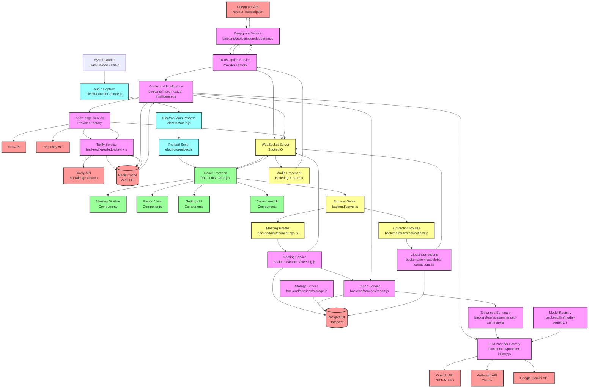

# TranscriptIQ System Architecture Dataflow Diagram

## Key Components Overview

### 1. Audio Processing Pipeline
- **System Audio Capture**: Electron desktopCapturer → Audio Processing → WebSocket
- **Latency Target**: <50ms for audio capture

### 2. Transcription Pipeline  
- **Audio Buffering**: Format conversion and batching
- **Deepgram Integration**: Real-time WebSocket transcription (~250ms)
- **Multiple Provider Support**: Deepgram, AssemblyAI, Whisper, Google, Azure, Rev.ai, Speechmatics

### 3. AI Intelligence Pipeline
- **Term Extraction**: GPT-4o Mini identifies key terms (<500ms)
- **Contextual Analysis**: Multi-provider LLM support (OpenAI, Anthropic, Gemini)
- **Knowledge Retrieval**: Tavily/Exa/Perplexity integration (<1000ms)

### 4. Data Management
- **PostgreSQL**: Meeting data, transcripts, corrections, usage metrics
- **Redis**: Term definition caching (24hr TTL)
- **Storage Service**: Sequence caching and data persistence

### 5. Real-time Communication
- **WebSocket Server**: Bidirectional communication for audio, transcripts, intelligence
- **REST API**: Meeting management and corrections CRUD operations

### 6. Provider Architecture
- **Factory Pattern**: Dynamic provider switching for LLM, transcription, knowledge
- **Model Registry**: Available model enumeration per provider
- **Usage Tracking**: Cost calculation and metrics collection

### 7. Frontend Architecture
- **React Components**: Meeting sidebar, report view, settings, corrections
- **Real-time Updates**: WebSocket integration for live data
- **Electron Bridge**: System audio access and IPC communication

## Critical Performance Requirements
**Total Latency Target: <2000ms**
- Audio Capture: <50ms
- Transcription: <300ms (Deepgram Nova-2)  
- Term Extraction: <500ms (GPT-4o Mini)
- Knowledge Retrieval: <1000ms (Tavily)